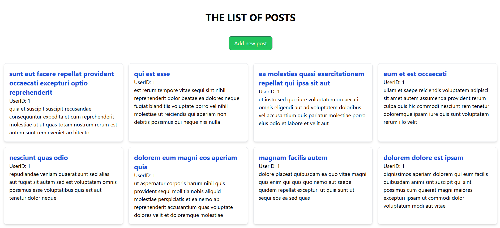
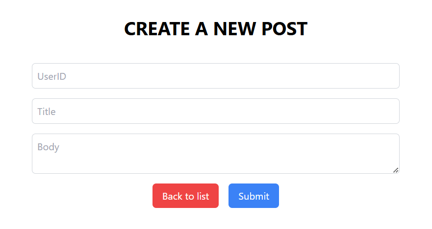
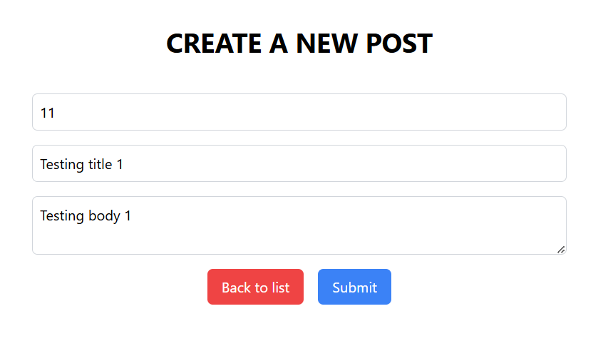
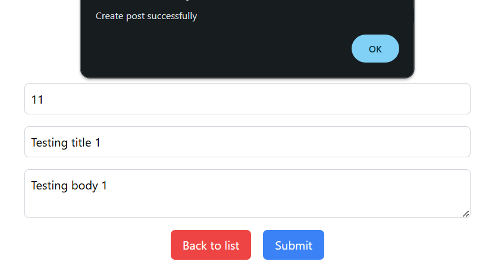
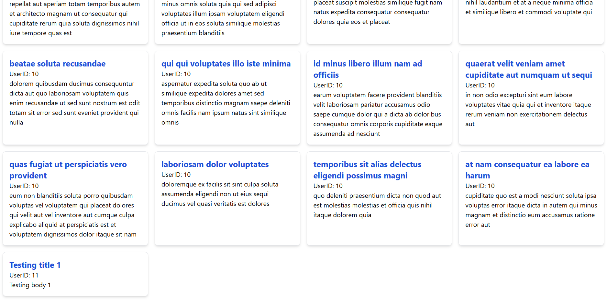

# Task 3: React-Redux Application

## Overview

This project fetches and displays posts from [JSONPlaceholder](https://jsonplaceholder.typicode.com/posts) using Redux for state management.

## Technologies

- ReactJS
- Redux Toolkit
- Tailwind CSS

## Getting Started

1. Clone the repository
2. Run `npm install`
3. Run `npm start` to start the app

## API

- **GET** `/posts` - Fetch the list of posts

  

  **Description**: Displays posts fetched from the API.

 

- **POST** `/posts` - Add a new post

  

  **Description**: Form to input post details.

 

**Description**: User filling in information in the form.

 

**Description**: Confirmation of successful post submission.

 

**Description**: Updated list reflecting the newly added post.
